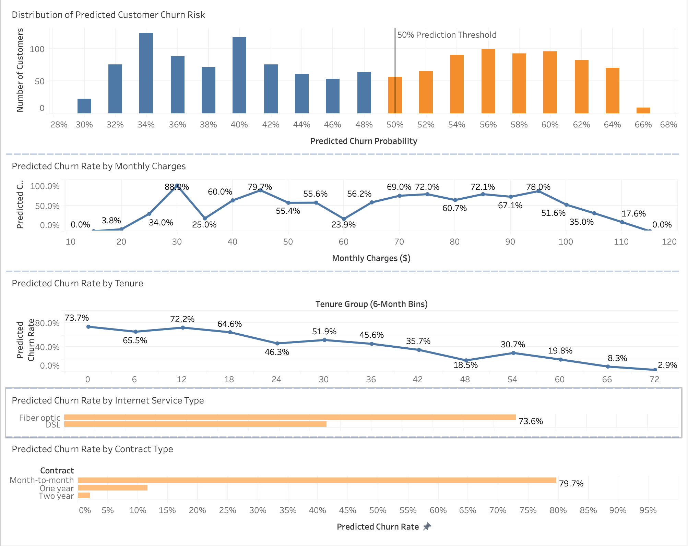
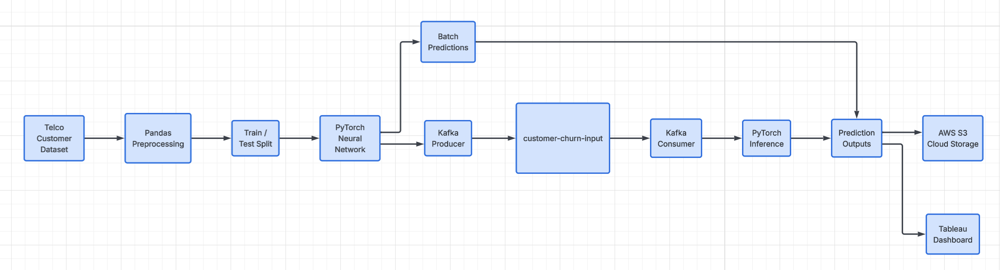
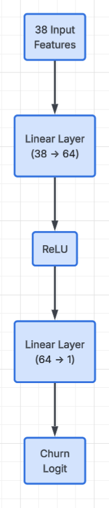

# Customer Churn Risk Dashboard with Streaming Predictions

I have produced a machine learning pipeline that predicts telecommunications
customer churn using PyTorch. It simulates streaming customer events
with Apache Kafka, stores prediction outputs in AWS S3, and presents
risk patterns through an interactive Tableau dashboard.

## Dashboard

The Tableau dashboard summarizes predicted churn risk across several customer characteristics, including contract type, internet service, monthly charges, and customer tenure.
## Project Overview
Customer churn is an important business problem because identifying customers who are at risk of leaving can help organizations focus 
on retaining those customers.

This project builds a churn prediction pipeline using the Telco Customer Churn dataset. The workflow begins with data preprocessing in Pandas, followed by training a binary classification model in PyTorch. The trained model then generates churn probabilities and predicted churn classifications for unseen customers.

I wanted to expand beyond a traditional batch machine learning workflow, so I utilized Apache Kafka to simulate customer records arriving as streaming events. A Kafka consumer loads the trained PyTorch model and scores each incoming customer record in real time.

Prediction outputs are also uploaded to Amazon S3 for cloud storage and are visualized in Tableau through a dashboard designed to highlight patterns in predicted churn risk.

The project demonstrates a complete workflow involving:

- Data preprocessing
- Machine learning model training
- Batch inference
- Streaming inference with Kafka
- Cloud storage with AWS S3
- Data visualization with Tableau
## Architecture
The project follows the pipeline below:

## Tech Stack
| Technology   | Purpose                                             |
| ------------ | --------------------------------------------------- |
| Python       | Main programming language                           |
| Pandas       | Data cleaning and preprocessing                     |
| scikit-learn | Train/test splitting, encoding, and feature scaling |
| PyTorch      | Neural network model training and inference         |
| Apache Kafka | Simulated real-time customer event streaming        |
| Docker       | Local Kafka runtime environment                     |
| AWS S3       | Cloud storage for prediction outputs                |
| Boto3        | Python SDK used to upload files to AWS              |
| Tableau      | Interactive churn-risk dashboard                    |
| Matplotlib   | Model training-loss visualization                   |
| Git / GitHub | Version control and project documentation           |

## Model
The project uses a feed forward neural network implemented in PyTorch for binary churn classification.



The model is defined as:
```
model = nn.Sequential(
    nn.Linear(X_train_tensor.shape[1], 64),
    nn.ReLU(),
    nn.Linear(64, 1)
)
```
The final layer does not contain a Sigmoid activation because the model is trained using BCEWithLogitsLoss, which combines the sigmoid operation and binary cross-entropy calculation internally.

Because the dataset contains substantially fewer churn customers than non-churn customers, the loss function uses a positive-class weight:
```
criterion = nn.BCEWithLogitsLoss(pos_weight=pos_weight)
```

This increases the penalty for incorrectly classifying customers from the minority churn class.

The model's logits are converted into probabilities using the sigmoid function:
```
probabilities = torch.sigmoid(logits)
```
Customers with a predicted probability of at least 0.50 are classified as predicted churn customers.
## Results
| Metric                  | Result |
| ----------------------- | -----: |
| Test Customers          |  1,409 |
| Test Accuracy           | 63.88% |
| Recall                  | 21.93% |
| Predicted Positive Rate | 21.22% |
| Actual Positive Rate    | 26.54% |
| True Positives          |     82 |
| False Positives         |    217 |
| True Negatives          |    818 |
| False Negatives         |    292 |

The dataset is imbalanced, with fewer churn customers than non-churn customers. To prevent the model from focusing too heavily on the majority non-churn class, class weighting was used to place greater importance on correctly identifying churn customers.

Model performance remains a limitation of the current implementation. Although class weighting was introduced to address class imbalance, the model achieved 21.9% recall and did not outperform the majority class baseline on accuracy. Future work will focus on model tuning, threshold selection, and comparison with baseline classifiers.

The model's training and test loss were also tracked across epochs and saved as:
```
models/training_loss.png
```

## Repository Structure
```text
Customer-Churn-Risk-Dashboard-with-Streaming-Predictions/
|
├── data/
│   ├── raw/
│   ├── processed/
│   └── predictions/
|
├── models/
│   ├── churn_model.pt
│   └── training_loss.png
|
├── notebooks/
|
├── src/
│   ├── preprocess.py
│   ├── train_model.py
│   ├── predict.py
│   ├── kafka_producer.py
│   ├── kafka_consumer.py
│   └── upload_to_s3.py
|
├── tableau/
│   ├── dashboard.png
│   └── customer_churn_dashboard.twbx
|
├── .gitignore
├── README.md
└── requirements.txt
```

Directory purposes
- data/raw/ — original churn dataset
- data/processed/ — processed train/test features and labels
- data/predictions/ — batch and streaming prediction outputs
- models/ — trained PyTorch model and training visualizations
- notebooks/ — exploratory analysis and development work
- src/ — production-style Python scripts for the pipeline
- tableau/ — Tableau workbook and dashboard image
## Setup
1. Clone the repository
```
git clone https://github.com/elijhagordon000/Customer-Churn-Risk-Dashboard-with-Streaming-Predictions.git
cd Customer-Churn-Risk-Dashboard-with-Streaming-Predictions
```
2. Create a virtual environment
```
python3 -m venv venv
```
Activate it on macOS/Linux:
```
source venv/bin/activate
```
3. Install dependencies
```
pip install -r requirements.txt
```
4. AWS configuration
AWS credentials are not stored in this repository.

The project uses an AWS CLI profile for authenticated access to S3.

## Running the Pipeline

### 1. Preprocess the data
Run:
```
python src/preprocess.py
```
### 2. Train the model
Run:
```
python src/train_model.py
```
### 3. Generate batch predictions
Run:
```
python src/predict.py
```
### 4. Start Kafka
Apache Kafka runs locally using Docker.

Start the Kafka container:
```
docker start kafka-local
```
The project uses the Kafka topic:
```
customer-churn-input
```
Kafka is used to simulate customer records arriving individually from an external business application.
### 5. Run the consumer
Open a terminal and run:
```
python src/kafka_consumer.py
```
The consumer remains active after processing existing messages because it continues waiting for future Kafka events.
### 6. Run the producer
In a second terminal, run:
```
python src/kafka_producer.py
```
The producer reads customer records from the processed test dataset and publishes them individually to Kafka as JSON messages.

Each event contains the customer's model features along with a row_id.

The resulting workflow is: 


### 7. Upload predictions to AWS S3
Run:
```
python src/upload_to_s3.py
```
The script uses Boto3 to upload:
```
data/predictions/scored_customers.csv
```
to an Amazon S3 location similar to:
```
s3://<your-s3-bucket-name>/predictions/scored_customers.csv
```
AWS credentials are managed outside the repository through the AWS CLI profile and are never hardcoded into the project.
## Tableau Dashboard
The final prediction output is analyzed in Tableau to make model results easier to interpret.

The dashboard contains five primary views:
### 1. Distribution of Predicted Customer Churn Risk
Displays the distribution of model-generated churn probabilities using 2% probability bins.

A reference line at:
```
50%
```
shows the classification threshold separating predicted churn and predicted non-churn customers.

### 2. Predicted Churn Rate by Contract Type
Compares the percentage of customers predicted to churn within each contract category.

### 3. Predicted Churn Rate by Internet Service Type
Compares predicted churn rates between internet-service categories.

### 4. Predicted Churn Rate by Monthly Charges
Groups customers by monthly-charge ranges and examines how the model's predicted churn classifications vary across those groups.

### 5. Predicted Churn Rate by Tenure
Groups customers into six month tenure ranges and displays the percentage predicted to churn in each group.

## Key Findings
The dashboard revealed several notable patterns in the model's predictions.

- **Contract type showed a strong relationship with predicted churn.** Approximately 79.7% of month to month customers were classified as churners, compared with approximately 11.7% of one-year customers and 2.1% of two-year customers.
- **Fiber-optic customers showed a higher predicted churn rate than DSL customers.** The dashboard showed a predicted churn rate of approximately 73.6% for fiber optic customers compared with approximately 42.8% for DSL customers.
- **Predicted churn generally declined as customer tenure increased.** Customers in the earliest tenure groups had predicted churn rates above 60%, while customers near the longest tenure ranges had predicted churn rates below 10%.
- **The model generally produced moderate rather than extreme churn probabilities.** Most testset predictions fell roughly between 30% and 66%, with the 50% threshold separating predicted churn and non-churn classifications.

These findings describe patterns in the model's predictions and should not be interpreted as causal relationships.
## Limitations / Future Improvements
This project is intended as an end-to-end machine learning and data engineering portfolio project rather than a production churn system.

Current limitations include:

- The neural network architecture is relatively simple.
- The model is trained using a single public churn dataset.
- Model probabilities have not been formally calibrated.
- The Kafka stream is simulated locally rather than receiving live production events.
- Kafka runs locally through Docker rather than on a managed cloud streaming platform.
- The current model could be compared with additional algorithms such as logistic regression, random forest, XGBoost, or deeper neural networks.
- Future versions could deploy inference through a cloud API
## Data Source
This project uses the [Telco Customer Churn dataset](https://www.kaggle.com/datasets/blastchar/telco-customer-churn).

The dataset contains customer account, service, billing, contract, and churn information used to train the binary classification model.

**Dataset license/usage terms:** Dataset usage is subject to the terms specified on the original Kaggle dataset page.